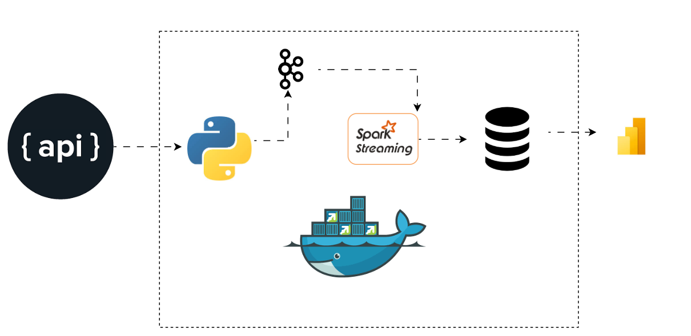

# Project Name: Real Stock Market Analysis

## Table of Contents
- `Overview`
- `Challenges`
- `Screenshot`
- `My process`
- `Built with`
- `What I learned`
- `Author`
- `Acknowledgements`

### Overview

The Project implements a real-time data pipeline that extracts stock data from vantage API, stream it through Apache Kafka, processes it with Apache Spark, and loads it into a postgres database.

All components are containerized with Docker for easy deployment.

### Screen-shot Data Pipeline Architecture

### Built with (project Tech Stack and Flow)
- `Kafka UI - inspect topics/messages`.
- `API - produces JSON events into kafka`
- `Spark - consumes from kafka, writes to postgres`
- `Postgres - store result for analytics`
- `PgAdmin - manage postgres visually`
- `Power BI - external (connects to Postgres database)`

### Challenges
- `Unable to retrieve data successfully from the API due to typing error`
- `Docker hub used previously is no longer available`
- `Connection from kafker to consumer keep failing with several error messages due to several typo error`
- `Trouble with user name and password while trying to connect to pgadmin as the .env file could not read`

### My Process

- `create a folder named Producer and create a virtual environment     (venv) where all dependencies, packages and configurations will be stored *create venv by executing python -m venv venv*`
- `Activate the venv by running venv\Scripts\activate on your terminal`
- `create a file in your producer folder and named it extract.py `
- `copy the request from rapid Api and placed it in the extract.py`
- `make a request to the RapidApi using python programmiing language`
- `create a second file and named it config.py to configure all your request from the RapidAPi`
- `install the required packages by using pip install request, python-dotenv`
- `create an entry point by creating a file named main.py to ensure we have an entry point to communicate with other services`
- `create a .env file in the root of your project`
- `create a compose file called compose.yml where all the services required for the success of our project`
- `create a producer_setup.py file where the producer will send data to kafka which is used for streaming data in real time`
- `Once data is received in real time to kafka and it will be passed to spark where data are cleaned and transformed`
- `it is then moved to our database which is the postgres`
- `our power bi is connected to our postgres for reporting and visualizing which is used by data analyst or business stakeholder to make a business decision`

### SERVICES
- `API - RapidApi is used for this project to get Real time stock data`
- `KAFKA` - `This is the nervous system and power house of our project that allow us to collect, store and process our streaming data from our API`
- `SPARK - once any new data arrived in our kafka, it picks them up in real time, it automatically collects any new data from kafka and it clean and transformed our data into a structured one`
- `POSTGRES - the structured data are moved to our database for onward use` 
- `POWER BI - It is connected to our postgresql in order to get data in real time`

### Other Developers
`for other developers to access this project run pip install -r requirement.txt`